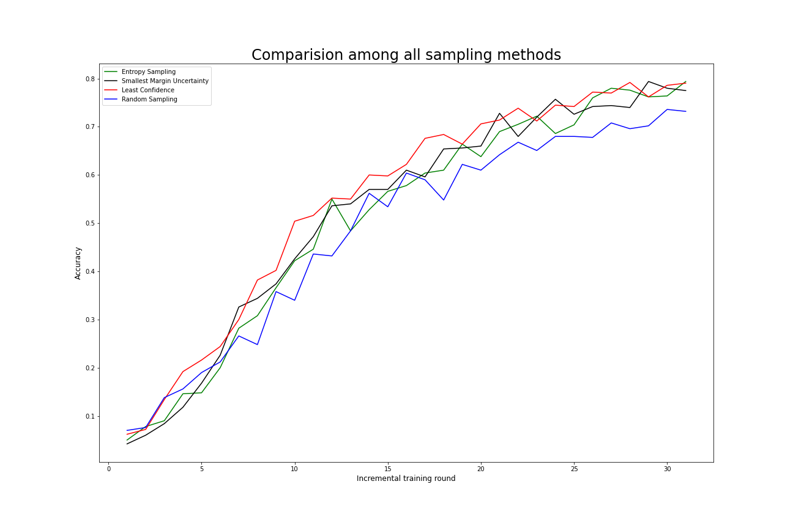
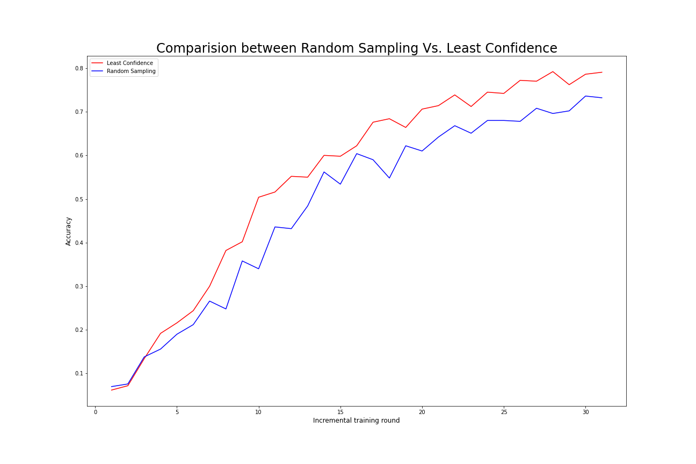
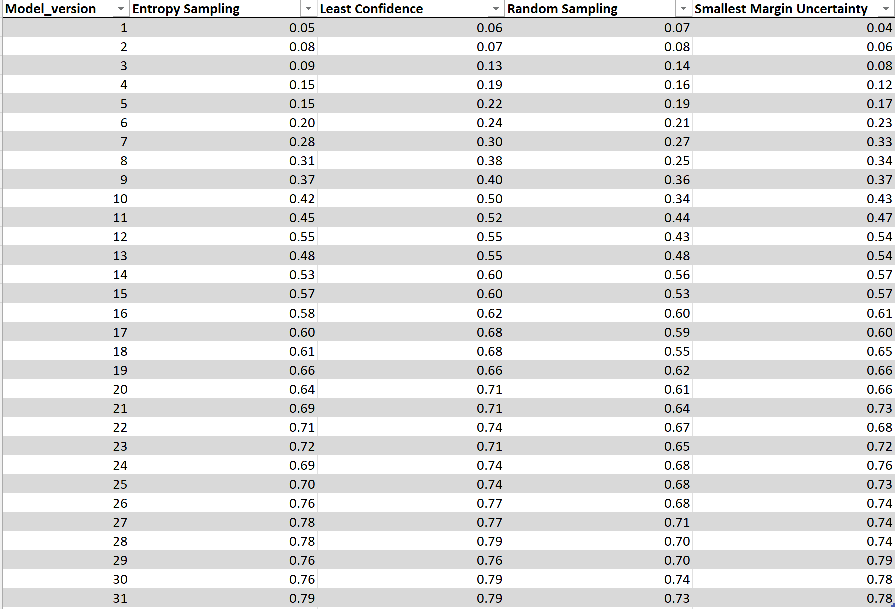

# Active Learning Implementation in Azure
Most supervised machine learning models require large amounts of data to produce good results. However, the process of labeling data can be time-consuming and expensive that represents a big barrier to machine learning development and adoption. 
Active Learning is the methodology to prioritize the data which needs to be labelled in order to have highest impact to model training and a mechanism to run continuous training to deployment process. Active Learning allows ML model deployment to start with small amount of labelled data and low performance but can get better faster over time with lower labelling effort compared with investing in labeling large amount of data to start with.
We created a reference implementation in Azure for Active Learning to demonstrate how Active Learning works in practice. This comes with templates and libraries to facilitate implementing a new Active Learning in Azure.
  

  

 
Active Learning flow has two main blocks: Model Training and Model in Production. Like normal MLOps, these two blocks are connected and changes are deployed from Model Training to Model In Production automatically. There are important features that make Active Learning flow different from regular MLOps:
-	Scoring result of deployed model is collected and used as input for Model Improvement. 
-	At the beginning of Model Improvement, a prioritization strategy is applied to select a portion of the scoring result for human labeling. The strategy can be Least Confidence (LC), Smallest Margin Uncertainty (SMU),Entropy Sampling (ES) and Random Sampling (RS). Other than the Random Sampling, other strategies are meant to select examples that the model is least certain about for labeling by human and therefore can improve the effectiveness of incremental training
-	Selected data is fed into a labeling process with human 
-	Labelled data is exported and fed into a training pipeline
-	Training pipeline performs incremental training with additional labelled examples. The examples are effective in addressing most important mistakes made by the previous model
-	Deployment pipeline deploys the improved model to production
-	The loop continues 

   

  

Technical design is the implementation of the functional flow with Azure components.
-	Scoring service is implemented with Managed Online or Batch Endpoint.
-	We created a Model and Data monitoring library to collect data from scoring service, then store at Azure Data Explorer tables and leverage ADX’s strength in scalable data analysis to perform data selection and analytic queries 
-	Model monitoring collects prediction data including probabilities, predicted label and raw image data store them at ADX tables and Azure storage
-	An Azure ML Labeling project is set up with input data folder in Azure ML storage location configured to be refreshed automatically for human labeling 
-	A data selection service job runs periodically on the collected prediction data where a prioritization strategy is applied to select part of the data. Selected examples are sent to input location of the Azure ML Labeling project
-	AML Labeling creates tasks for human labelers to work on new data
-	Human labeler releases labelled data as AML dataset 
-	Azure function with blob queue trigger call a github workflow to kick start training and deployment pipeline (github workflow)
-	Training step within the pipeline loads current model checkpoint and perform incremental training with newly labelled data. At the end, it produces a new version of the model
-	Deployment step kicks in to deploy new model version to production
  

### Simulation module
  

To support evaluation of Active Learning, we included a simulation flow that replaces the human labeling step with an automated labeling module. Here, a labelled dataset of 15k images is used. The flow is as follows:
-	Initial training and deployment of a model on a small dataset sampled from the full dataset
-	A scoring simulation module that samples data from the full dataset, minus data that was used and score with the deployed model. 
-	Scored data is collected and prioritized using standard modules. Here, the output is directly joined with full labelled dataset to obtain label instead of being sent to Azure ML Labeling.
-	Training dataset is created and sent for training and deployment.
Using the simulation mode, you can evaluate the effectiveness of Active Labeling with different settings. This, however, requires a large labelled dataset.
The diagram and table below shows comparision of progress of model performance in Active Learning Simulation after 30 rounds of incremental active learning training, each with 50 labeled images which are sampled from 500 images used for scoring.

  

  

  

  

#### Observation 
There seems to be no clear winner among Confidence (LC), Smallest Margin Uncertainty (SMU),Entropy Sampling (ES) strategies. However, compared to Random Sampling, for example, with Least Confidence in the simulation exersize, we observe about 5-10% better in accuracy in each incremental training round. Another observation is the more selective it is, the more effective a deliberate strategy is compared to random sampling method. 

 

